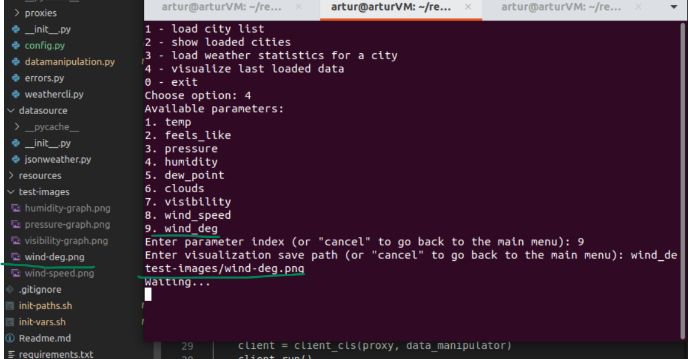
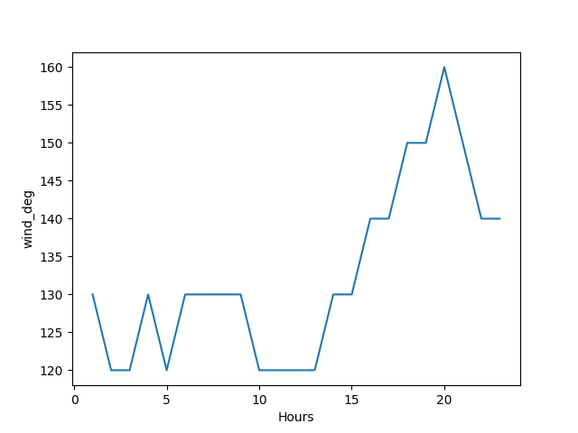
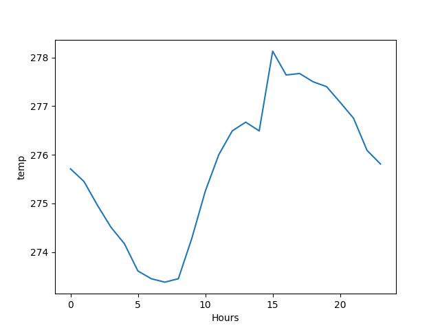

# JBAD Python project

#### Weather statistics visualization

Artur Sokol

Python used: 3.8

To prepare the environment:

```bash
$ virtualenv -p=/usr/bin/python3.8 jbad-project-env
$ cd jbad-project-env
$ source bin/activate
$ git clone <repo-url>/jbad-project.git
$ cd jbad-project
$ pip install -r requirements.txt
```

To set up extra variables to be able to run `ProxyStub` check (city list and demo DB `.json` paths are initialized)

```bash
(jbad-project-env) $ pwd
# should be inside jbad-project
(jbad-project-env) $ source init-vars.sh
```

To be able to run any `.py` in the project tree (not only `visualweather.py`, which is the entrypoint though), initialize `site-packages` with necessary paths. To be able to get the expected result, one should be under `virtualenv` and have `__init__.py` in each subpackage:

```bash
(jbad-project-env) $ ./init-paths.sh
```

---

### External API used

1. [Weather API](https://openweathermap.org/);

---

### Data internal format

```json
{
  "temp": "current temperature, in Celcius",
  "feels_like": "human perception of the temperature",
  "pressure": "in hPa",
  "humidity": "in %",
  "visibility": "average visibility, in meters",
  "wind_speed": "metre/sec",
  "wind_direction_degree": "degrees",
  "cloudness": "%",
  "datetime": "datetime type",
  "sunrise": "timestamp",
  "sunset": "timestamp"
}
```

---

### Changelog

#### Version 0.3 (in progress)

* _server_ is running and handling requests from the client proxy;
* **data access** is defined and used by __data server__. Dispatcher _server_ (the one which handles client requests) calls **data servers** (model server) and retrieves necessary data;
* `ServerProxy` on the client side is implemented and sends requests to _server_;
* a script which should retrieve and store weather data is prepared and can be set up to be executed periodically;

#### Version 0.2

* start separating on components - _client_, _server_ (on this version is called directly from a corresponding client proxy), **data access**, **data manipulation**;
* client `.py` config, which is going to read from ENV;
* _server_ talks to **data access**;
* _client_ uses **data manipulation** API, has a proxy for server communication;
* client proxy is responsible for preparing a complete dataset for _client_. For _client_ it is completely transparent how data is downloaded from _server_;
* no server communication here;





#### Version 0.1

* no split on different components, only client draft (very poor) is implemented;
* client reads from previously prepared dataset for several regions and supports data visualization;
* client is console;
* no direct Weather API calls;


