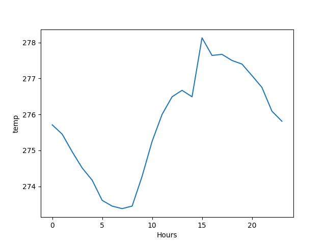

# JBAD Python project

#### Weather statistics visualization

Artur Sokol

Python used: 3.8

To prepare the environment:

```bash
$ virtualenv -p=/usr/bin/python3.8 jbad-project-env
$ git clone <repo-url>/jbad-project.git
$ cd jbad-project
$ pip install -r requirements.txt
```

---

### API used

1. [Weather API](https://openweathermap.org/);

---

### Changelog

#### Version 0 (working)

* no split on different components, only client is implemented;
* client reads from previously prepared dataset for several regions and supports data visualization;
* client is console;
* no direct Weather API calls;


