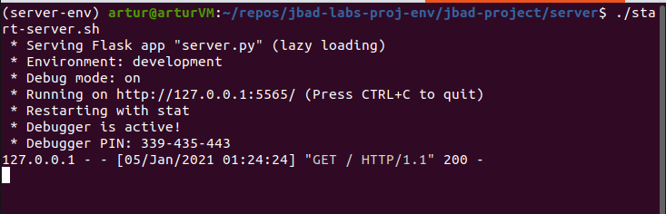

# JBAD Python project

#### Weather statistics visualization

Artur Sokol

Python used: 3.8

To prepare the environment:

```bash
$ virtualenv -p=/usr/bin/python3.8 jbad-project-env
$ cd jbad-project-env
$ source bin/activate
$ git clone <repo-url>/jbad-project.git
$ cd jbad-project
$ pip install -r requirements.txt
```

To prepare the env for the server side:

```bash
# if currently under jbad-project-env virtualenv
(jbad-project-env) $ deactivate
# in the project directory
$ virtualenv -p=/usr/bin/python3.8 server-env
$ source server-env/bin/activate
$ cd server
$ pip install -r requirements.txt
```

and start the dev server locally:

```bash
(server-env) jbad-project/server$ ./start-server.sh
```



To set up extra variables to be able to run `ProxyStub` check (city list and demo DB `.json` paths are initialized)

```bash
(jbad-project-env) $ pwd
# should be inside jbad-project
(jbad-project-env) $ source init-vars.sh
```

To be able to run any `.py` in the project tree (not only `visualweather.py`, which is the entrypoint though), initialize `site-packages` with necessary paths. To be able to get the expected result, one should be under `virtualenv` and have `__init__.py` in each subpackage:

```bash
(jbad-project-env) $ ./init-paths.sh
```

---

### External API used

1. [Weather API](https://openweathermap.org/);

---

### Data internal format

```json
{
  "temp": "current temperature, in Celcius",
  "feels_like": "human perception of the temperature",
  "pressure": "in hPa",
  "humidity": "in %",
  "visibility": "average visibility, in meters",
  "wind_speed": "in meter/sec",
  "wind_direction_degree": "degrees",
  "cloudness": "in %",
  "datetime": "datetime type",
  "sunrise": "timestamp",
  "sunset": "timestamp"
}
```

---

### Local container deployment

* better to start  **dispatcher-server** first, because it also starts Redis server
* but before deploying there should be a _docker network_ created:

```yaml
# from docker-compose.yml, both components have it
networks:
  servers:
    external:
      name: servers  # this network should exist
```

to create it:

```bash
~/jbad-projects$ docker network create servers
```

and then start everything:

```bash
~/jbad-project$ cd dispatcherserver
~/jbad-project/dispatcherserver$ docker build -t \
    dispatcher-img .
~/jbad-project/dispatcherserver$ docker-compose -f \
    docker-compose.yml up -d
# to start containers in 'detach mode'

~/jbad-project/dispatcherserver$ cd ../modelserver
~/jbad-project/modelserver$ docker build -t \
    model-img .
~/jbad-project/modelserver$ docker-compose -f \
    docker-compose.yml up -d
```

---

### Changelog

#### Version 0.7 (in progress)

* enrich UI:
  * make visualization submenu with not only selecting a separate field and visualizing it;
  * provide user-friendly field name mapping to show not raw field names, but their clear description;
  * a separate menu for keeping multiple data chunks and comparing them on the same plots. For now let it be only plotting a chosen parameter;
  * group data (when visualizing) by hour (for _daily_), by day (for _weekly_ and _monthly_) and show these options for the user;
  * choose two parameters and make a scatter plot for them;

#### Version 0.6

* add possibility to run servers in containers;
* available `docker-compose` file to start a local deployment where all servers communicate and Redis server is also containerized;
* retrieved weather data is stored in docker volumes;
* now model servers register themselves through the dispatcher;

#### Version 0.5

* having a weather JSON DB implement a data access on **model server**;
* remove all mock data and prepare a reacher API for data requests - get current weather and get weather for date range;

#### Version 0.4

* a script which should retrieve and store weather data is prepared and can be set up to be executed periodically;
* key storage logic is implemented on the _dispatcher server_ side;
* add some default data to model server requests;
* connect _dispatcher server_ and **model server**;

#### Version 0.3

* _dispatcher server_ is running and handling requests from the client proxy;
* **model server** is defined. _Dispatcher server_ (the one which handles client requests) calls **model servers** and retrieves necessary data;
* `ServerProxy` on the client side is implemented and sends requests to _server_;

#### Version 0.2

* start separating on components - _client_, _server_ (on this version is called directly from a corresponding client proxy), **data access**, **data manipulation**;
* client `.py` config, which is going to read from ENV;
* _server_ talks to **data access**;
* _client_ uses **data manipulation** API, has a proxy for server communication;
* client proxy is responsible for preparing a complete dataset for _client_. For _client_ it is completely transparent how data is downloaded from _server_;
* no server communication here;


#### Version 0.1

* no split on different components, only client draft (very poor) is implemented;
* client reads from previously prepared dataset for several regions and supports data visualization;
* client is console;
* no direct Weather API calls;


